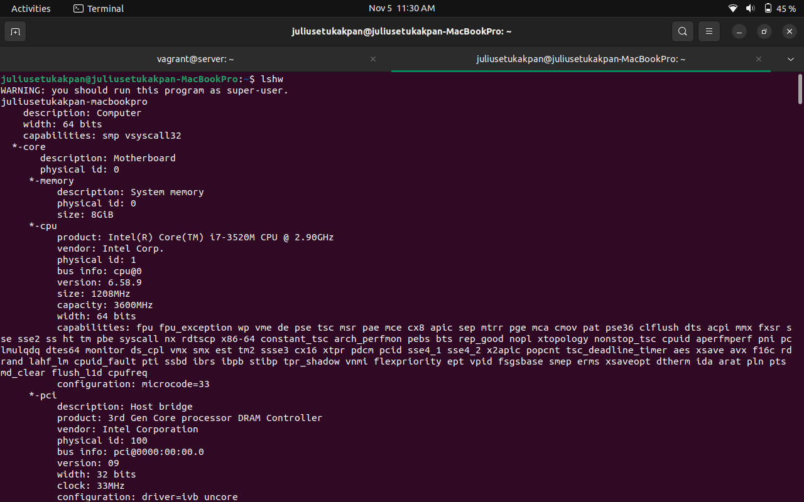
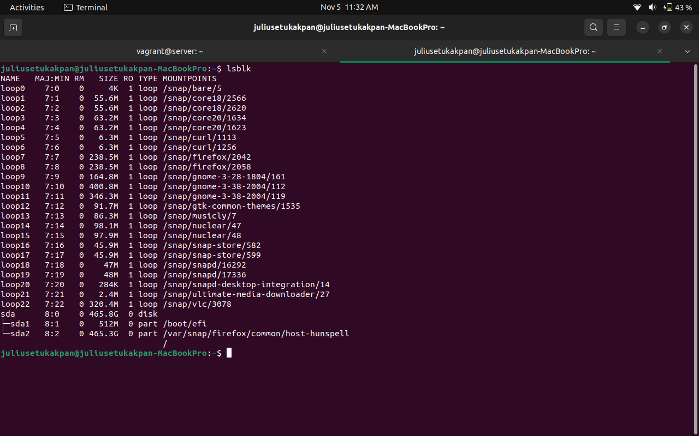
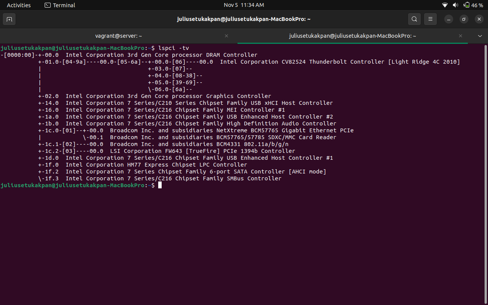
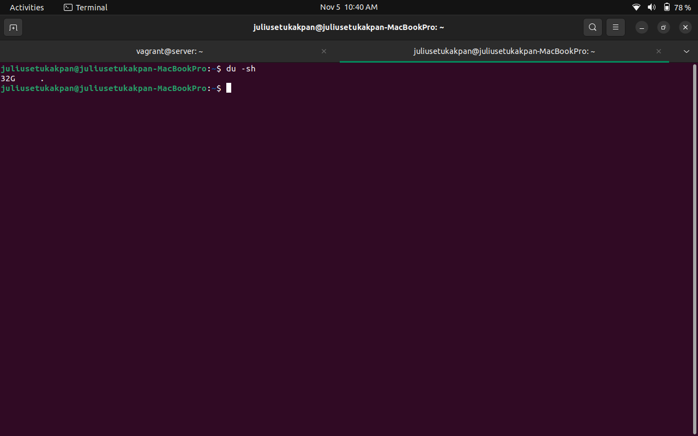
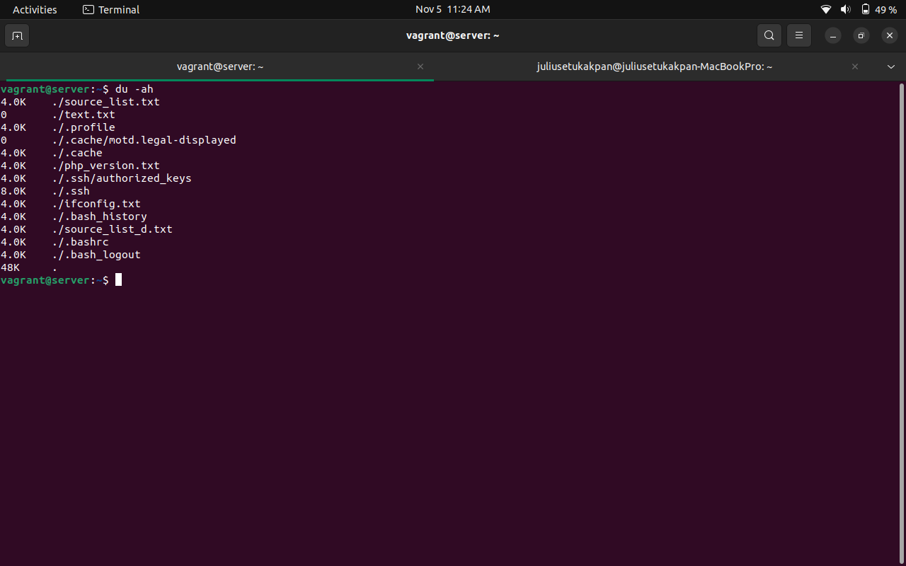
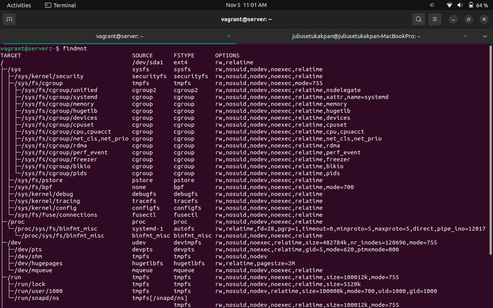
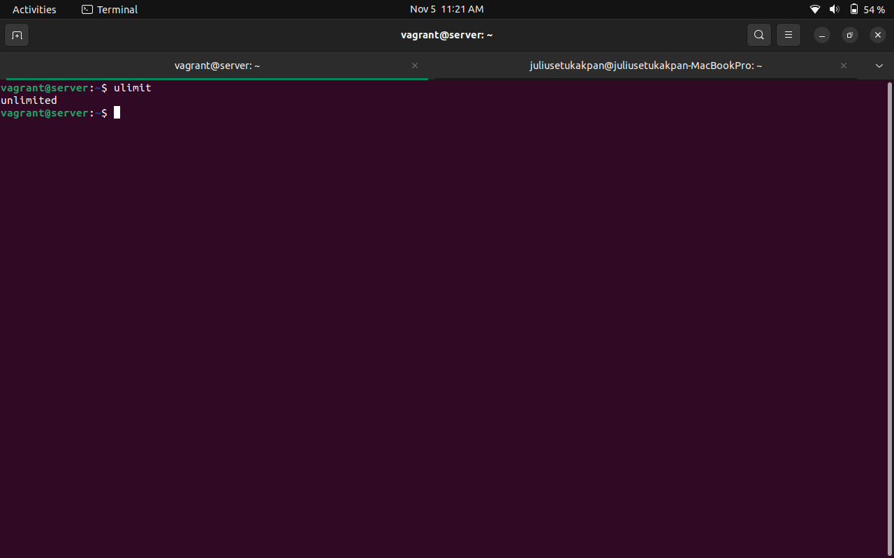
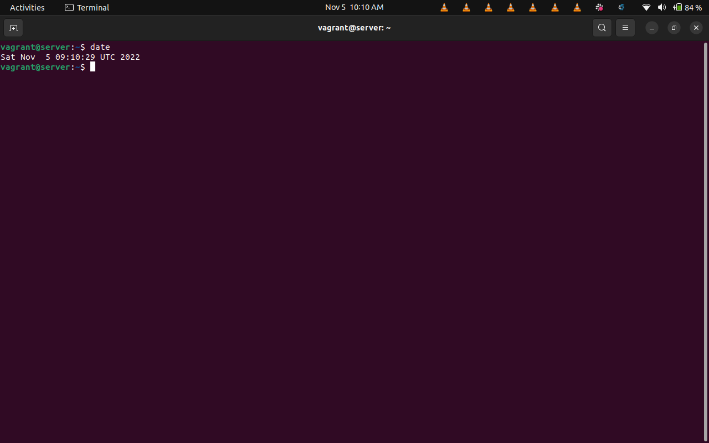
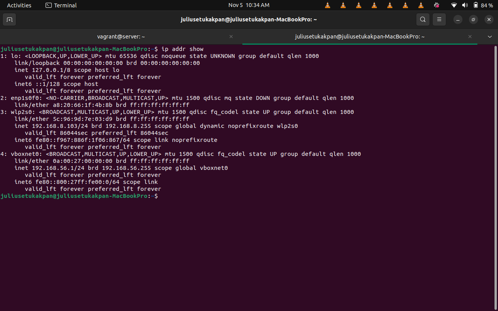

# ## **10 LINUX COMMAND**

# What is a Linux command?

Linux is a family of open-source Unix-like operating systems based on the Linux kernel. The Linux command is a utility of the Linux operating system. All basic and advanced tasks can be done by executing commands. The commands are executed on the Linux terminal. The terminal is a command-line interface to interact with the system, which is similar to the command prompt in the Windows OS. Commands in Linux are case-sensitive.

## Linux system management Command

1. systemctl Command

The systemctl command is a utility which is responsible for examining and controlling the systemd system and service manager. It is a collection of system management libraries, utilities and daemons which function as a successor to the System V init daemon. The new systemctl commands have proven quite useful in managing a servers services

_syntax_

$ systemctl status apache2

_output_

## Hardware Information

The hardware command can be used to fetch hardware information via the terminal.

2. lshw command
the lshw command is used to see hardware configuration info

_syntax_

$ lshw

_output_

3. lsblk command
the lsblk command is used to block info

_syntax_

$ lsblk

_output_

4. lspci-tv command
the lspci-tv command is used to see tree diagram of pci devices

_syntax_

$ lspci-tv

_output_

## Disk Usage
the disk usage command is used in Keeping track of disk utilization information is on system administrators

5. du -sh
the du -sh shows disk usage for current directory

_syntax_

$ du -sh

_output_

6. du -ah
the du -ah shows disk usage for all files

_syntax_

$ du -sh

_output_

7. findmnt
the du -sh shows disk usage for current directory

_syntax_

$ du -sh

_output_

## System Management and Info
 the system mangement and info commands helps to extract information about your Linux system and hardware components.

8. ulimt
ulimit is a built-in Linux shell command that allows viewing or limiting system resource amounts that individual users consume. Limiting resource usage is valuable in environments with multiple users and system performance issues.

_syntax_

$ ulimit

_output_

9. date
this command shows date

_syntax_

$ ulimit

_output_

## Network Managment

process of configuring, monitoring, and managing the performance of a network.

10. ip addr
this command shows the ip address
 

_syntax_

$ ip addr

_output_

## THE END
